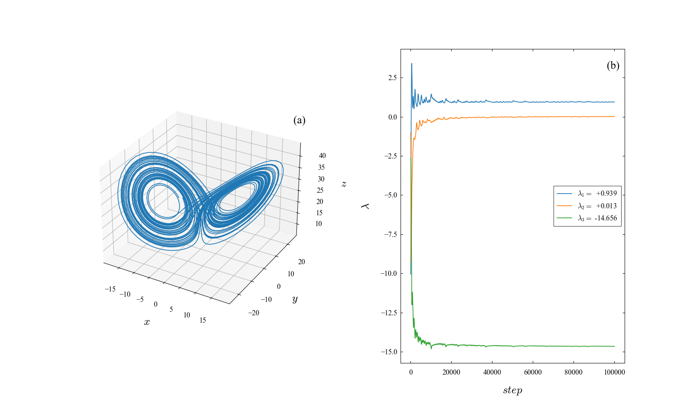
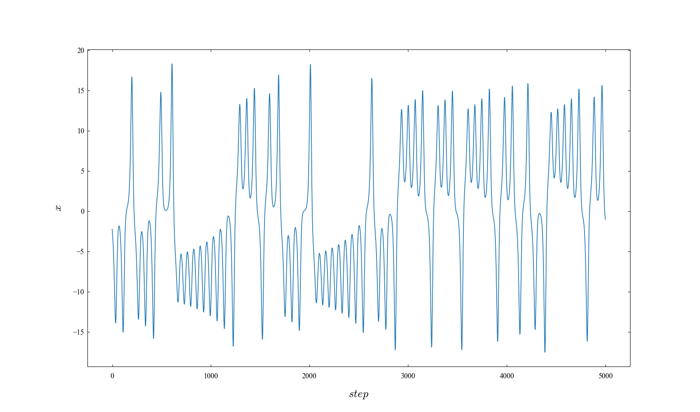
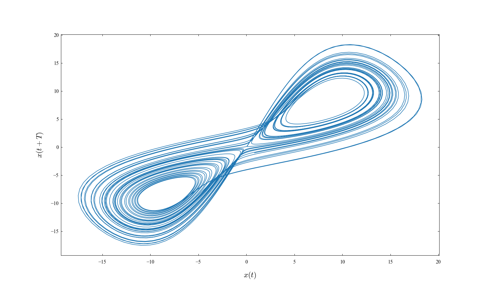
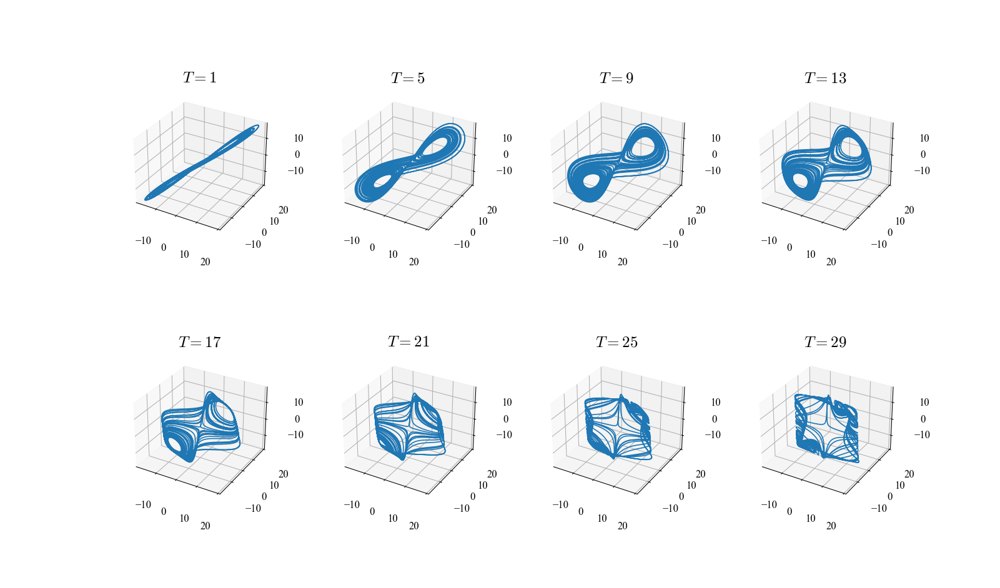

# hundun

hundun is a python library for the exploration of chaos.   
Please note that this library is in beta phase.

## Example

Import the package's equation object.

```python
from hundun import Differential
```

Crating a differential equation is easy using `Differential`.
The important thing is to define `parameter()` and `equation()` as methods.


```python
class Lorenz(Differential):

    def parameter(self, s=10, r=28, b=8/3):
        self.s, self.r, self.b = s, r, b
        self.dim = 3

    def equation(self, t, u):
        s, r, b = self.s, self.r, self.b

        x, y, z = u

        x_dot = s*(y - x)
        y_dot = r*x - y - x*z
        z_dot = x*y - b*z

        return x_dot, y_dot, z_dot
```

Various methods can be used by creating an instance of `Lorenz`.
As a test, use `.solve_n_times` to solve the equation in 5000 steps.
(This method uses RK4 by default.) 

```python
l = Lorenz.on_attractor()
l.solve_n_times(5000)
```

At this time, you can get the time and orbit by using `.t_seq` and `.u_seq`.


It is possible to calculate the **Lyapunov exponent**(spectrum) from the orbit using `Lorenz` above.
In addition, a calculation method based on QR decomposition can be used by defining `jacobian()`(Jacoby matrix).

```python
class Lorenz2(Lorenz):
    def jacobian(self):
        s, r, b = self.s, self.r, self.b
        x, y, z = self.u

        j = [[-s, s, 0],
             [r-z, -1, -x],
             [y, x, -b]]

        return j
```

`calc_les` automatically determines and calculates.

```python
from hundun.lyapunov import calc_les

les_seq, les = calc_les(Lorenz2)
```


Also, you can easily draw by using `Drawing` of utils.

```python
from hundun.utils import Drawing

d = Drawing(1, 2, three=1, number=True)

d[0,0].plot(l.u_seq[:,0], l.u_seq[:,1], l.u_seq[:,2])
d[0,0].set_axis_label('x', 'y', 'z')

for i in range(3):
    d[0,1].plot(les_seq[:, i], label=fr'$\lambda_{i+1}=${les[i]:>+8.3f}')
d[0,1].legend(loc='center right')
d[0,1].set_axis_label('step', r'\lambda')

d.show()
```




Currently, time series analysis methods are being added!


# Documentation

## Installation

hundun can be installed via pip from PyPI.

```bash
pip install hundun
```

To use the latest code (unstable), checkout the dev branch and run above command in the main hundun directory.

```python
pip install .
```

## exploration
### Introduction
The following example uses a 1-dim time series (x) obtained from the Lorenz equation. Equation were numerically integrated by Runge-Kutta method with a time with h=0.01 for 5000 time steps.



```python
u_seq = np.load('sample/data/lorenz_x.npy')
```


### Embedding (埋め込み)
Generate a time series using the embedding dimension `D` and the time lag `L`.   

```Python
from hundun.exploration import embedding
```

Generate a time series by using `embedding(u_seq, T, D)` and plot the result.

```python
e_seq = embedding(u_seq, 10, 2)

d = Drawing()
d[0,0].plot(e_seq[:, 0], e_seq[:, 1])
d[0,0].set_axis_label('x(t)', 'x(t+T)')
d.show()
```



The result of calculation with D=3 and shifting T is shown below.




## Dependencies

[{ Numpy }](https://numpy.org)
[{ Scipy }](https://scipy.org)
[{ Matplotlib }](https://matplotlib.org)
